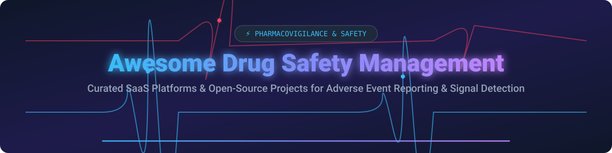

# Awesome Drug Safety Management 💊

  

  
  
  
  

## 🔬 Top Drug Safety Management Ecosystem & Pharmacovigilance Tools

**Curated List of SaaS Platforms & Open-Source GitHub Projects**  
*Focused on Pharmacovigilance (PV), Adverse Event (AE) Reporting, ICSR Case Intake, MedDRA Coding, and Safety Signal Detection.*  

**Last updated: September 2026** 📅

---

### 🌐 Overview & Market Context
This repository tracks notable **SaaS platforms** and **open-source software** for **Drug Safety Management** (Pharmacovigilance). These tools manage adverse event intake, case processing, regulatory reporting (FDA FAERS, EMA EudraVigilance, PMDA), and safety signal detection for pharmaceutical companies, CROs, and regulatory affairs teams.

**Open-Source Emphasis** 🔓: Open-source solutions provide statistical signal detection packages (Empirical Bayes, Disproportionality ROR/PRR), clinical trial AE reporting modules, and AI-assisted E2B(R3) parsing tools — ideal for academic pharmacovigilance groups, researchers, and teams building custom safety pipelines.

---

## 📑 Table of Contents
- [🏢 SaaS/Hosted Platforms](#-saashosted-platforms)
- [💻 Open-Source GitHub Projects](#-open-source-github-projects)
- [🤝 How to Contribute](#-how-to-contribute)
- [💖 Support & Sponsorship](#-support--sponsorship)
- [📈 Star History](#-star-history)
- [⚠️ Disclaimer](#%EF%B8%8F-disclaimer)

---

## 🏢 SaaS/Hosted Platforms

> **📊 Market Size & Industry Structure**:  
> The global **Pharmacovigilance Software & Drug Safety Market** is estimated at **$210M–$240M** (software-only) to **$7.5B+** (including broader safety services), growing at a CAGR of 7.2%. The sector is **moderately concentrated & slightly fragmented**: dominant legacy platforms (Oracle Argus, ArisGlobal, Veeva Vault) hold high enterprise market share, while specialized AI & cloud-native challengers continue to expand.

| Company / Product | Market Size (Revenue / Valuation) | Estimated Starting Price | Free Tier / Trial Limit | Key Features & Description |
| :--- | :--- | :--- | :--- | :--- |
| **[Oracle Argus](https://www.oracle.com/life-sciences/safety-solutions/argus-safety-case-management/)** 🏢 | **~$300B Valuation** (Oracle Corp Parent) | $15,000 / year (Entry tier module pricing) | No free trial (14-day sandboxed demo on request) | Industry-standard case management, E2B messaging, Argus Insight & Affiliate regulatory compliance. |
| **[IQVIA Vigilance](https://www.iqvia.com/)** 🏥 | **~$40B Valuation** | $12,000 / year (Base tier suite) | No free trial (Sales demo environment) | End-to-end pharmacovigilance platform, literature screening, global regulatory gateway connectivity. |
| **[Veeva Vault Safety](https://www.veeva.com/)** ☁️ | **~$32B Valuation** | $10,000 / year (Base cloud seat tier) | 30-day proof-of-concept sandbox | Modern cloud ICSR management system, automated MedDRA/WHODrug updates, multi-tenant GxP cloud. |
| **[ArisGlobal LifeSphere](https://www.arisglobal.com/)** 🤖 | **~$1.5B Valuation** | $8,500 / year (LifeSphere Starter tier) | 14-day guided trial for LifeSphere Reporter | AI-first pharmacovigilance platform, NavaX signal detection, 80% faster ICSR intake & triage. |
| **[Ennov](https://www.ennov.com/)** 📋 | **~$50M - $100M Valuation** | $5,000 / year (Starter PV module) | 14-day request-based trial | Regulatory information management and pharmacovigilance safety software for biotech & mid-market. |
| **[EXTEDO](https://www.extedo.com/)** 🛡️ | **~$30M - $60M Valuation** | $4,500 / year (Safety module entry) | 14-day request-based demo | Regulatory safety management, eCTD submissions, and Pharmacovigilance safety reporting. |
| **[Celegence](https://www.celegence.com/)** 📑 | **~$20M - $50M Valuation** | $4,000 / year (Service/Software bundle) | 14-day request-based demo | Regulatory and pharmacovigilance technology for automated safety case intake & compliance. |
| **[SARUS](https://www.sarus.com/)** ⚡ | **~$10M - $30M Valuation** | $3,500 / year (Base tier) | 14-day free trial sandbox | Streamlined adverse event reporting platform and drug safety database for biotech & CROs. |
| **[AB Cube](https://www.abcube.com/)** 📦 | **~$10M - $25M Valuation** | $3,000 / year (SafetyEasy entry tier) | 15-day free trial on SafetyEasy database | Cloud safety database solutions (SafetyEasy) for multi-vigilance case processing and reporting. |
| **[Pharmapod](https://www.pharmapod.com/)** 💊 | **~$5M - $15M Valuation** | $1,200 / year ($100/mo per location) | 30-day free trial | Incident management & adverse event reporting system tailored for community pharmacies & clinics. |

---

## 💻 Open-Source GitHub Projects

The following active open-source projects provide statistical models, adverse event reporting systems, and AI workflows for drug safety.

*Sorted by GitHub Stars_Count (Descending)* ⭐

- **[openFDA Pharmacovigilance Tools](https://github.com/topics/openfda)**  ⭐  
  Official FDA open data initiatives and community analytical toolkits leveraging the openFDA API for real-time adverse event analysis, FAERS querying, and hybrid RAG biomedical intelligence.

- **[caAERS](https://github.com/CBIIT/caaers)**  ⭐  
  Cancer Adverse Event Reporting System from NCI-CBIIT. Enterprise Java/Spring web application supporting clinical trials adverse event collection, protocol compliance, and regulatory safety querying.

- **[simaerep](https://github.com/openpharma/simaerep)**  ⭐  
  Open-source R package from the IMPALA Consortium for real-time detection of clinical trial adverse event under-reporting and over-reporting using statistical probability scoring.

- **[Pharmaverse / Safety Graphics](https://github.com/pharmaverse/safetyGraphics)**  ⭐  
  Interactive R/Shiny framework for clinical trial safety monitoring, liver toxicity evaluation (eDISH), and automated adverse event charting compliant with CDISC SDTM/ADaM standards.

- **[Pharmaverse / SafetyData](https://github.com/pharmaverse/safetyData)**  ⭐  
  Standardized clinical trial safety datasets formatted according to CDISC SDTM & ADaM standards, designed for testing pharmacovigilance algorithms and adverse event workflows.

- **[pvEBayes](https://github.com/YihaoTancn/pvEBayes)**  ⭐  
  Comprehensive R package for empirical Bayes signal detection in pharmacovigilance (Gamma-Poisson Shrinker, Koenker-Mizera, Efron non-parametric empirical Bayes). Published on CRAN & Statistics in Medicine.

- **[MakerChecker PV ICSR Processing](https://github.com/makerchecker/MakerChecker)**  ⭐  
  Agentic AI workflow for pharmacovigilance ICSR processing enforcing separation of duties, 21 CFR 314.80 human-in-the-loop gates, and regulatory E2B(R3) submission safeguards.

- **[REDCap Adverse Event Reporting](https://github.com/PHSERIS/ae_reporting)**  ⭐  
  REDCap module simplifying Adverse Event form creation for FDA, IRB, and ClinicalTrials.gov templates, eliminating manual data aggregation steps.

- **[MDDC (Multiple Drug-Drug Comparison)](https://cran.ma.ic.ac.uk/web/packages/MDDC/refman/MDDC.html)** 🧪  
  Open-source R package for statistical analysis of adverse event contingency tables with adaptive boxplot grid search for false discovery rate (FDR) control in signal detection.

- **[OpenVigil](https://openvigil.sourceforge.net/)** 🌐  
  Open-access data mining web engine and API for querying FDA FAERS adverse event reports with ROR, PRR, and Proportional Reporting Ratio metrics.

---

## 🤝 How to Contribute

1. **Fork** the repository 🍴
2. Add/edit entries in `README.md` following the standard table/markdown format.
3. Ensure all links are active and facts (pricing, Stars_Counts, market size) are verified.
4. Submit a **Pull Request** with a brief summary of additions 🚀

---

## 💖 Support & Sponsorship

If you find this pharmacovigilance & drug safety management list helpful, please consider supporting the project:

- 🌟 **Star** this repository to help others discover it!
- 🔀 **Fork** and contribute new tools or open-source libraries.
- ☕ **Buy me a coffee / Sponsor**: Support ongoing maintenance at [GitHub Sponsors](https://github.com/sponsors/ishandutta2007).

---

## 📈 Star History

---

## ⚠️ Disclaimer

- This list is community-curated for informational purposes only and does not constitute medical or regulatory advice.
- Production pharmacovigilance operations must adhere to strict GxP regulations (21 CFR Part 11, 21 CFR 314.80, EU GVP, ICH E2B(R3)).
- MedDRA and WHODrug medical coding dictionaries are proprietary and require separate organization licensing.

---

  <b>Made with ❤️ for Pharmacovigilance Professionals, Drug Safety Officers, &amp; Healthcare Data Scientists worldwide.</b>

